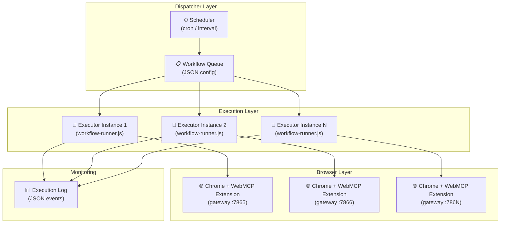

# Phân Tích: Có Nên Tạo Studio App Để Chạy Predefined Workflows?

## TL;DR — Nên, nhưng KHÔNG nên clone RPA Studio App

Ý tưởng phân phối workflow đã test vào các instance chạy tự động hàng ngày là **rất đúng hướng**. Tuy nhiên, bạn **không nên** nhân bản [rpa-studio-app](file:///Users/ttcenter/Desktop/VIBE_CODE/flow-auto-browser-extension/applications/rpa-studio-app) vì nó quá nặng cho mục đích này. Thay vào đó, bạn nên xây dựng một **Headless Workflow Executor** nhẹ hơn.

---

## Phân Tích Chi Tiết

### Những Gì Bạn Đã Có

| Thành phần | Vai trò | Trạng thái |
|---|---|---|
| [runner/](file:///Users/ttcenter/Desktop/VIBE_CODE/web-automation-extension/.archive/runner) | Workflow engine: validate → normalize → execute steps tuần tự | ✅ Hoàn chỉnh (753 LOC runner, validator, normalizer, context, transport) |
| [.examples/workflows/](file:///Users/ttcenter/Desktop/VIBE_CODE/web-automation-extension/.examples/workflows) | JSON workflows đã test (Facebook post, Gemini chat) | ✅ Tested |
| [.examples/automation-scripts/](file:///Users/ttcenter/Desktop/VIBE_CODE/web-automation-extension/.examples/automation-scripts) | JS scripts (scrape Dantri, Facebook posting, screenshot...) | ✅ Tested |
| [run.js](file:///Users/ttcenter/Desktop/VIBE_CODE/web-automation-extension/.archive/runner/run.js) | CLI entry point cho runner | ✅ Có sẵn `--dry-run`, `--var`, `--json-events` |
| [transport.js](file:///Users/ttcenter/Desktop/VIBE_CODE/web-automation-extension/.archive/runner/transport.js) | HTTP gateway client → WebMCP extension | ✅ Kết nối gateway `localhost:7865` |

### RPA Studio App — Quá Nặng Cho Use Case Này

[rpa-studio-app](file:///Users/ttcenter/Desktop/VIBE_CODE/flow-auto-browser-extension/applications/rpa-studio-app) là một **authoring + editing surface** cấp enterprise:

- ❌ **Next.js UI full-blown** (Workflow Editor, Library UI, Template Authoring Hub)
- ❌ **AI Assistant chat panel** tích hợp LLM để generate workflows
- ❌ **Visual canvas** với node inspector, subflow execution
- ❌ **API server** với execution engine, relay dispatcher, SSE events
- ❌ **Tailwind + postcss + vitest** — overhead dev tooling

> [!WARNING]
> Clone một app 2.0 đã qua 7 versions changelog chỉ để chạy headless workflow hàng ngày là **overkill nghiêm trọng**. Bạn sẽ mất thời gian maintain một codebase phức tạp trong khi chỉ dùng 5% chức năng.

---

## Đề Xuất: Kiến Trúc "Workflow Dispatcher"

Thay vì clone Studio App, tôi đề xuất kiến trúc nhẹ gồm 3 tầng:



### Thành Phần Cần Xây

#### 1. `workflow-dispatcher.js` — Scheduler + Queue
```
Nhiệm vụ:
- Đọc file config (danh sách workflows + schedule)
- Cron hoặc interval trigger
- Phân phối workflow vào executor instances
- Quản lý retry logic ở cấp workflow-level
```

#### 2. `executor-instance.js` — Thin Wrapper Quanh Runner
```
Nhiệm vụ:
- Nhận workflow JSON + gateway URL  
- Gọi WorkflowRunner (đã có sẵn!)
- Stream events ra log
- Report kết quả về dispatcher
```

#### 3. `config.json` — Deployment Config
```json
{
  "instances": [
    {
      "id": "fb-poster-1",
      "gatewayUrl": "http://localhost:7865/api",
      "workflows": [
        {
          "path": "workflows/facebook/post_text.json",
          "schedule": "0 9 * * *",
          "variables": { "POST_TEXT": "Good morning! {{__DATE__}}" }
        }
      ]
    },
    {
      "id": "scraper-1", 
      "gatewayUrl": "http://localhost:7866/api",
      "workflows": [
        {
          "path": "workflows/gemini/chat.json",
          "schedule": "*/30 * * * *",
          "variables": { "PROMPT": "Tóm tắt tin tức hôm nay" }
        }
      ]
    }
  ]
}
```

---

## So Sánh 2 Hướng

| Tiêu chí | Clone RPA Studio App | Workflow Dispatcher (đề xuất) |
|---|---|---|
| **Thời gian xây** | 2-3 tuần (adapt + strip UI) | 2-3 ngày |
| **Lines of Code** | ~20,000+ LOC | ~500-800 LOC |
| **Dependencies** | Next.js, Tailwind, vitest, LLM... | Node.js vanilla + node-cron |
| **Maintenance** | Nặng — phải sync 2 codebases | Nhẹ — independent |
| **Runner engine** | Phải port/adapt execution engine | Dùng thẳng `workflow-runner.js` |
| **Multi-instance** | Phải tự thêm | Designed for it |
| **Scheduling** | Không có sẵn | Built-in cron |
| **Monitoring** | Có UI nhưng overkill | JSON logs + optional dashboard |
| **JS script support** | Phải adapt | Wrap trong `evaluateJS` step |

---

## Kế Hoạch Thực Hiện (nếu bạn đồng ý)

### Phase 1 — Core Dispatcher (Day 1)
- [ ] Tạo project `workflow-dispatcher/` trong `web-automation-extension/`
- [ ] Port `runner/` từ `.archive/` (hiện đang archived!) vào project mới
- [ ] Xây `dispatcher.js` với cron scheduling
- [ ] Xây `config.json` schema + validator

### Phase 2 — Multi-Instance (Day 2)
- [ ] Instance manager: mỗi instance = 1 Chrome profile + 1 gateway port
- [ ] Health check: ping gateway trước khi dispatch
- [ ] Execution queue: tránh overlap workflows trên cùng instance

### Phase 3 — Monitoring & Reliability (Day 3)
- [ ] JSON event logger (tận dụng `--json-events` có sẵn)
- [ ] Retry at workflow level (khác step-level retry đã có)
- [ ] Optional: simple web dashboard hiển thị run history

> [!IMPORTANT]
> Runner code hiện nằm trong `.archive/` — điều này cho thấy bạn đã từng archive nó. Trước khi bắt tay làm, cần xác nhận: **runner code có còn tương thích với version gateway hiện tại không?**

---

## Về Hỗ Trợ JS Scripts

Các automation scripts như [dantri.js](file:///Users/ttcenter/Desktop/VIBE_CODE/web-automation-extension/.examples/automation-scripts/dantri.js), [post_text.js](file:///Users/ttcenter/Desktop/VIBE_CODE/web-automation-extension/.examples/automation-scripts/facebook/post_text.js) hiện dùng `gateway_client.js` trực tiếp. Có 2 cách tích hợp:

1. **Wrap trong JSON workflow** — tạo workflow với 1 step `evaluateJS` chứa logic
2. **Script executor riêng** — dispatcher hỗ trợ cả `.json` workflow và `.js` script

Tôi khuyên **cách 2** vì scripts phức tạp (như Facebook post_with_gradient 12KB) rất khó nhồi vào 1 `evaluateJS` step.

---

## Kết Luận

> [!TIP]
> **Có, bạn nên làm** — nhưng build một **Workflow Dispatcher nhẹ** thay vì clone Studio App. Bạn đã có 90% engine code sẵn rồi (runner, transport, validator, normalizer). Chỉ cần thêm scheduling + multi-instance orchestration.
